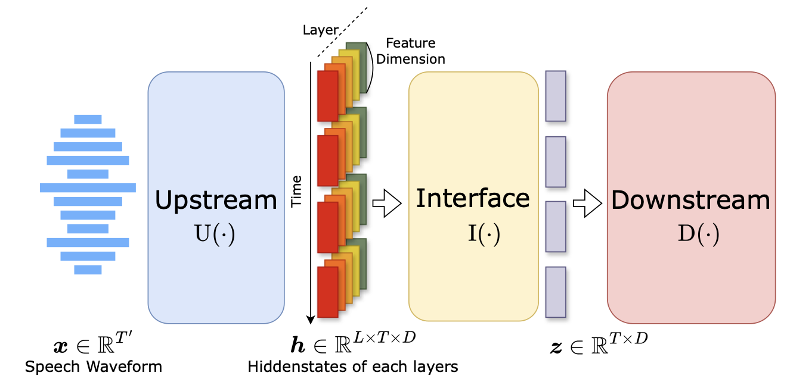

# Interface Design for Self-Supervised Speech Models


<p align="center">
    
    <br/>
    <a href=""> </a>
    <a href=""> </a>
    <a href="https://github.com/atosystem/SSL_Interface/issues"></a>
    <a href="https://github.com/atosystem/SSL_Interface/pulls"></a>
</p>

Links: [arXiv](https://arxiv.org/abs/2406.12209)


> Interface module for Self-supervised Speech Models


## Install
1. First clone the repo
    ```bash
    git clone git@github.com:atosystem/SSL_Interface.git
    ```
2. install the repo
    ```bash
    cd SSL_Interface
    pip install -e .
    ```

## Usage
```python
import torch
import SSL_Interface
import SSL_Interface.configs
import SSL_Interface.interfaces


WS_Interface = SSL_Interface.interfaces.WeightSumInterface(
    SSL_Interface.configs.WeightedSumInterfaceConfig(
        upstream_feat_dim=768,
        upstream_layer_num=13,
        normalize=False,
    )
)

HConv_Interface = SSL_Interface.interfaces.HierarchicalConvInterface(
    SSL_Interface.configs.HierarchicalConvInterfaceConfig(
        upstream_feat_dim=768,
        upstream_layer_num=13,
        normalize=False,
        conv_kernel_size=5,
        conv_kernel_stride=3,
        output_dim=768
    )
)


layer, batch_size, seq_len, hidden_size = 13,8,100,768

feats = torch.randn(layer, batch_size, seq_len, hidden_size)

feats = feats.cuda()
WS_Interface = WS_Interface.cuda()
HConv_Interface = HConv_Interface.cuda()

out = WS_Interface(feats)
print(out.shape)
# torch.Size([8, 100, 768])

out = HConv_Interface(feats)
print(out.shape)
# torch.Size([8, 100, 768])

```

## Reference Repositories
[s3prl](https://github.com/s3prl/s3prl)
## Citation
```
@article{shih_interface_2024,
  title={Interface Design for Self-Supervised Speech Models},
  author={Yi-Jen Shih and David Harwath},
  journal={Interspeech},
  year={2024},
  publisher={IEEE}
}
